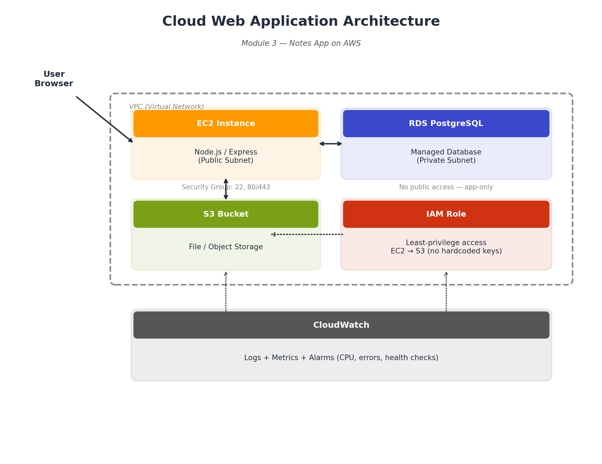

# Cloud Notes App — Module 3

A small full-stack notes application demonstrating cloud service integration: compute, managed database, object storage, IAM, networking, and monitoring — deployed end-to-end on AWS.

**Live app:** [add your live URL here after deployment]

## Architecture



- **Compute:** EC2 (Ubuntu, Node.js/Express) — or deploy via Elastic Beanstalk
- **Database:** RDS PostgreSQL, private subnet, not publicly accessible
- **Storage:** S3 bucket for file attachments
- **Networking:** VPC with security groups — only 22/80/443 exposed on the app tier, DB reachable only from the app's security group
- **IAM:** EC2 IAM Role scoped to `s3:PutObject`/`s3:GetObject` on just this bucket — no hardcoded AWS keys
- **Monitoring:** CloudWatch for logs and metrics; `/health` endpoint for uptime checks

## Features
- Create/list/delete notes (`/api/notes`)
- Optional file attachment per note, uploaded to S3
- Structured JSON logging (`winston`) — ready for CloudWatch ingestion
- `/health` endpoint that checks live DB connectivity
- All secrets/config via environment variables — nothing hardcoded

## Local Development
```bash
git clone <this-repo-url>
cd cloud-webapp
npm install
cp .env.example .env   # fill in your local/dev DB and AWS details
npm run dev
```
Visit `http://localhost:3000`.

## Deployment
Full step-by-step AWS deployment instructions: [`docs/DEPLOYMENT.md`](docs/DEPLOYMENT.md)

Covers: creating the RDS instance, S3 bucket, IAM role, EC2 launch + security groups, running the app with `pm2`, and CloudWatch logging.

## Project Structure
```
cloud-webapp/
├── src/
│   ├── server.js      # Express app + routes
│   ├── db.js           # PostgreSQL (RDS) connection
│   ├── s3.js            # S3 upload helper
│   └── logger.js        # Structured logging (winston)
├── public/
│   └── index.html        # Frontend UI
├── docs/
│   ├── architecture.png
│   └── DEPLOYMENT.md
├── .env.example
└── package.json
```

## Security Notes
- No credentials committed — `.env` is gitignored
- Production AWS credentials come from the EC2 IAM Role, not access keys
- Database has no public endpoint — reachable only from the app tier's security group
- File uploads are size-limited (5MB) and typed via `multer`
